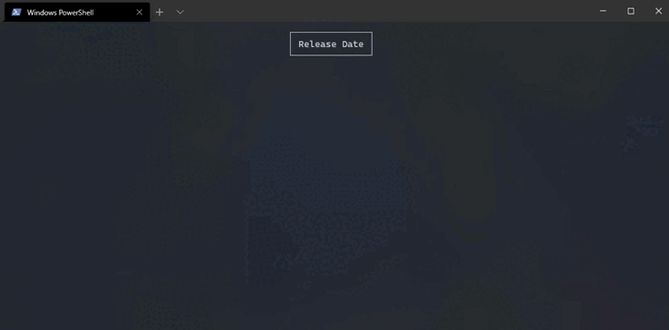

<h1 align="center">
 
 <br>
Spectre.Console: Interatividade e visualização de dados aprimoradas para suas aplicações de console  C#
</h1>

## 💻 Oque é a **[Spectre.Console](https://spectreconsole.net/)**?

Quando estamos iniciando os estudos em C#/.NET é comum criar os projetos do tipo console, assim como em qualquer outra linguagem, com o objetivo de treinar as funcionalidades e parcularidades da linguagem, dessa forma entendo seu funcionamento e treinando a lógica de programação. <br>

Com o decorrer de cada projeto vamos percebendo que podemos melhorar a interatividade e uma melhor exibição de dados no console, é ai que a Spectre.Console entra. <br>

Spectre.Console é uma biblioteca para .NET que facilita a construção de interfaces de linha de comando (CLIs) mais ricas e interativas. Permite exibir texto formatado, tabelas, gráficos, barras de progresso, menus e muito mais diretamente no teclado, proporcionando uma experiência de usuário mais interessante e informativa em aplicações de terminal.



<br>

## 📄 Documentação completa da Spectre.Console

No link abaixo pode ser encontrado a documentação completa da blioteca e com todos os seus recursos diponíveis.

- **[Spectre.Console](https://spectreconsole.net/)**

## 🛠️ Como Instalar?

Instale em seu projeto pelo comando abaixo pelo NuGet:

```bash
dotnet add package Spectre.Console
```

## 📝 Como utilizar?

importe a referencia namespace em sua classe e começe a usar os recursos.

- importanção da referêcia Spectre.Console

```bash
using Spectre.Console;
```

- Exemplo básico

```bash
using Spectre.Console;

public static class Program
{
    public static void Main(string[] args)
    {
        AnsiConsole.Markup("[underline red]Hello[/] World!");
    }
}
```

## 📚 Exemplos

### 📚 Exibição de livros em tabela

```bash
using Spectre.Console;

namespace BibliotecaProjeto.Modelos;

public class Livro
{
    public String Titulo { get; set; }
    public String Autor { get; set; }
    public String ISBN { get; set; }
    public DateTime DataPublicacao { get; set; }
    public bool EstaEmprestado { get; set; }

    public void ExibirInformacoes(List<Livro> livros)
    {
        if (livros.Count == 0)
        {
            Console.WriteLine("Nenhum livro disponível.");
        }
        else
        {
            var table = new Table();
            table.AddColumn("Titulo");
            table.AddColumn("Autor");
            table.AddColumn("ISBN");
            table.AddColumn("Data de Publicação");
            table.AddColumn("Está Emprestado");

            foreach (Livro livro in livros)
            {
                table.AddRow(
                    livro.Titulo,
                    livro.Autor,
                    livro.ISBN,
                   livro.DataPublicacao.ToString("dd/MM/yyyy"),
                   livro.EstaEmprestado ? "Sim" : "Não");
            }

            AnsiConsole.Write(table);
        }
    }

}

```


### 📚 Menu de opções ultilizando SelectionPrompt

```bash
using BibliotecaProjeto.Modelos;
using Spectre.Console;

namespace BibliotecaProjeto.Menus
{
internal class MenuPrincipal : Menu
{
private readonly Dictionary<int, Menu> opcoes;

        public MenuPrincipal(List<Usuario> usuarios, List<Livro> livros)
        {
            opcoes = new Dictionary<int, Menu>
            {
                { 1, new MenuRegistrarUsuario(usuarios) },
                { 2, new MenuAdicionarLivro(livros) },
                { 3, new MenuLivrosDisponiveis(livros)},
                { 4, new MenuEmprestarLivro(livros, usuarios) },
                { 5, new MenuDevolverLivro(livros, usuarios) },
                { -1, new MenuSair() }
            };
        }

        public override void Executar()
        {
            while (true)
            {
                int opcaoEscolhida = int.Parse(ExibirOpcoesDoMenu());

                if (opcoes.ContainsKey(opcaoEscolhida))
                {
                    Menu menuASerExibido = opcoes[opcaoEscolhida];
                    menuASerExibido.Executar();

                    if (opcaoEscolhida == -1)
                    {
                        break;
                    }

                    else
                    {
                        Console.Clear();
                        Console.WriteLine("Opção inválida\n");
                    }
                }
            }
        }

        private string ExibirOpcoesDoMenu()
        {
            var opcoes = new[]
            {
                "Registrar Usuário",
                "Adicionar Livro",
                "Exibir Livros Disponíveis",
                "Emprestar Livros",
                "Devolver Livro",
                "Sair"
            };

            string escolha = AnsiConsole.Prompt(
                new SelectionPrompt<string>()
                    .Title("Selecione uma opção:")
                    .AddChoices(opcoes)
            );


            var opcaoEscolhida = opcoes.ToList().IndexOf(escolha) + 1;
            if (opcaoEscolhida == opcoes.Length)
            {
                opcaoEscolhida = -1;
            }

            return opcaoEscolhida.ToString();
        }
    }

}
```


### 📚 Múltiplas opções ultilizando MultiSelectionPrompt

```bash
using BibliotecaProjeto.Modelos;
using Spectre.Console;

internal class MenuDevolverLivro : Menu
{
    private readonly List<Livro> _livros;
    private readonly List<Usuario> _usuarios;

    public MenuDevolverLivro(List<Livro> livros, List<Usuario> usuarios)
    {
        _livros = livros;
        _usuarios = usuarios;
    }

    public override void Executar()
    {
        base.Executar();
        ExibirTituloDaOpcao("Devolver Livro");

        Console.Write("Digite o CPF do Usuário: ");
        string cpf = Console.ReadLine()!;

        Usuario? usuario = _usuarios.FirstOrDefault(u => u.CPF == cpf);

        if (usuario != null)
        {
            usuario.ExibirNomeECpf();

            if (usuario.LivrosEmprestados.Any())
            {

                List<Livro> livros = new List<Livro>(usuario.LivrosEmprestados)
                {
                    new Livro { Titulo = "Cancelar", Autor = "" }
                };

                MultiSelectionPrompt<Livro>? prompt = new MultiSelectionPrompt<Livro>()
                    .Title("Selecione os livros para devolver:")
                    .PageSize(10)
                    .MoreChoicesText("[grey](Use as setas para cima e para baixo para mover)[/]")
                    .InstructionsText("[yellow]Pressione [blue]<espaço>[/] para selecionar uma opção,\n[green]<enter>[/] para confirmar,\nA opção [red]<Cancelar>[/] faz cancelar a devolução[/]\n\n")
                    .UseConverter(l => l.Titulo == "Cancelar" ? "[red]Cancelar[/]" : $"{l.Titulo} ({l.Autor})")
                    .AddChoices(livros);


                List<Livro>? livrosParaDevolver = AnsiConsole.Prompt(prompt);


                if (livrosParaDevolver.Any(l => l.Titulo == "Cancelar"))
                {
                    Console.WriteLine("\nOperação de devolução cancelada.");
                }
                else if (livrosParaDevolver.Any())
                {
                    foreach (var livroParaDevolver in livrosParaDevolver)
                    {
                        usuario.LivrosEmprestados.Remove(livroParaDevolver);

                        Livro? livroNaBiblioteca = _livros.FirstOrDefault(l => l.Titulo == livroParaDevolver.Titulo && l.Autor == livroParaDevolver.Autor);
                        if (livroNaBiblioteca != null)
                        {
                            livroNaBiblioteca.EstaEmprestado = false;
                        }

                        Console.WriteLine($"\nO livro '{livroParaDevolver.Titulo}' foi devolvido com sucesso.");
                    }
                }
                else
                {
                    Console.WriteLine("Nenhum livro selecionado para devolução.");
                }
            }
            else
            {
                Console.WriteLine("Este usuário não possui livros emprestados.");
            }
        }
        else
        {
            Console.WriteLine("Usuário não encontrado. Verifique o CPF digitado.");
        }

        Console.WriteLine("\nDigite uma tecla para voltar ao menu principal");
        Console.ReadKey();
        Console.Clear();
    }
}

```


## 📚 Exemplo completo

Os exemplos acima podem ser encontrados em um sistema símples de biblioteca, que pode ser encontrado no link abaixo:

- **[Projeto console de Blioteca em C#](https://github.com/WillianMedeiros14/Entregas_Estagio_Bemol/tree/Biblioteca-Semana6)**.

## 🚀 Principais recursos e tecnologias ultilizadas

- **[Documentação da linguagem C#](https://learn.microsoft.com/en-us/dotnet/csharp/)**.
- **[Spectre.Console](https://spectreconsole.net/)**.
